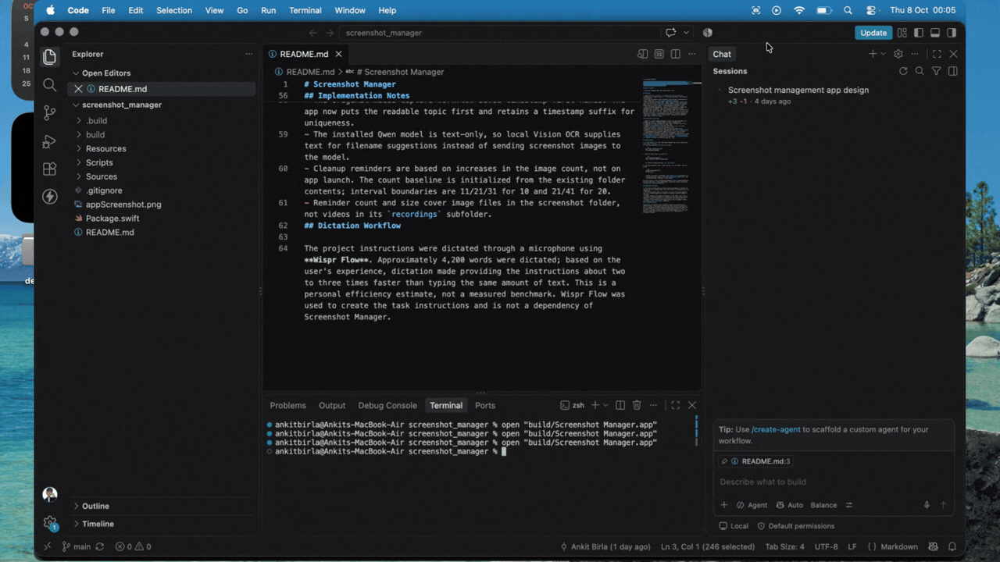
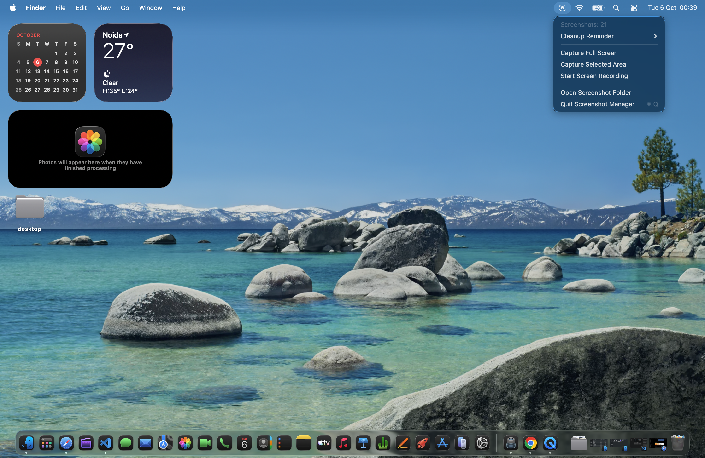

# Screenshot Manager

A native macOS menu bar utility for capturing, naming, copying, and organizing screenshots, plus recording the screen. Requires macOS 14 or later and Swift 6 (provided by Xcode Command Line Tools or Xcode). No third-party Swift packages are used.

## App Demo

Quick walkthrough of the main features and workflow in action:



Watch the demo video: https://youtu.be/POe4rvY88r8

## App Screenshot



## Features

- Capture the full screen or a selected area from the menu bar. Screenshots are saved as PNGs in `~/Pictures/screenshot` and copied to the clipboard.
- Start and stop macOS screen recording from the menu. Recordings are saved as MOV files in `~/Pictures/screenshot/recordings`.
- Give screenshots readable names: Apple Vision extracts visible text, then the local Ollama `qwen2.5:7b` model suggests a short description. Names start with the description and end with a timestamp. If OCR or Ollama cannot provide a name, a timestamp-based fallback is used.
- Choose **Cleanup Reminder** > **Every 10 Screenshots**, **Every 20 Screenshots**, or **Off**. The choice persists between launches. Reminders show screenshot count and combined image size; recordings are excluded. With the 10 option, reminders occur at 11, 21, 31, and so on; with 20, they occur at 21, 41, and so on. Existing files establish the baseline at launch, so relaunching alone does not trigger a reminder.
- Open the screenshot folder from the menu. The app can be added to Login Items to start at sign-in.

## Architecture and Stack

- **Swift 6 / Swift Package Manager** builds the app executable; the package uses Swift 5 language mode for source compatibility.
- **AppKit** provides the menu bar item, menu, clipboard, and alerts. The app runs as a menu bar-only accessory app.
- **macOS `screencapture`** performs full-screen, area, and video capture using Apple's capture UI and permissions.
- **Vision** performs on-device OCR. The text extracted from a screenshot is sent to the local **Ollama HTTP API** at `localhost:11434` for Qwen naming; the screenshot image itself is not sent to Ollama.
- **Foundation and Darwin** provide file management, preferences, process control, and folder monitoring. Screenshot counts and disk usage are calculated from image files directly inside `~/Pictures/screenshot`.
- `Resources/Info.plist` configures the app bundle. `Scripts/build-app.sh` compiles, bundles, and ad-hoc signs the `.app`.

## Build and Run

1. Install macOS 14 or later and Xcode Command Line Tools. Check Swift with `swift --version`.
2. Clone the repository and enter its folder:

	```sh
	git clone <repository-url>
	cd screenshot_manager
	```

3. Build the app bundle and launch it:

	```sh
	sh Scripts/build-app.sh
	open "build/Screenshot Manager.app"
	```

	To compile without bundling, run `swift build`.

4. For Qwen-generated names, install Ollama, pull the model, and start Ollama:

	```sh
	ollama pull qwen2.5:7b
	ollama serve
	```

	Ollama is optional: screenshots still save if it is unavailable. To run the app after sign-in, add `build/Screenshot Manager.app` under **System Settings > General > Login Items**.

On first capture, allow **Screenshot Manager** under **System Settings > Privacy & Security > Screen Recording**. macOS may require restarting the app after granting permission.

## Implementation Notes

- The original macOS capture workflow saved timestamp-first names. The app now puts the readable topic first and retains a timestamp suffix for uniqueness.
- The installed Qwen model is text-only, so local Vision OCR supplies text for filename suggestions instead of sending screenshot images to the model.
- Cleanup reminders are based on increases in the image count, not on app launch. The count baseline is initialized from the existing folder contents; interval boundaries are 11/21/31 for 10 and 21/41 for 20.
- Reminder count and size cover image files in the screenshot folder, not videos in its `recordings` subfolder.
## Dictation Workflow

The project instructions were dictated through a microphone using **Wispr Flow**. Approximately 4,200 words were dictated; based on the user's experience, dictation made providing the instructions about two to three times faster than typing the same amount of text. This is a personal efficiency estimate, not a measured benchmark. Wispr Flow was used to create the task instructions and is not a dependency of Screenshot Manager.